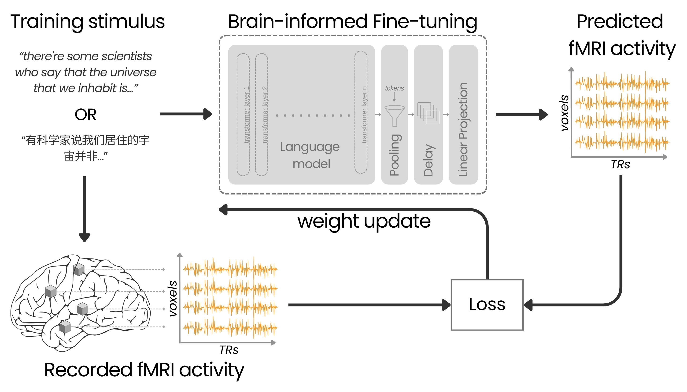

# Brain-Informed Fine-Tuning for Improved Multilingual Understanding in Language Models

This repository contains the code and resources for the paper:

**Brain-Informed Fine-Tuning for Improved Multilingual Understanding in Language Models**

*Authors*: Anuja Negi, Subba Reddy Oota, Anwar O Nunez-Elizalde, Manish Gupta, Fatma Deniz  
*Conference*: The Thirty-ninth Annual Conference on Neural Information Processing Systems (NeurIPS 2025)  
[Paper Link](https://openreview.net/forum?id=JPogehP8By)

## Overview



This repository provides the implementation of brain-informed fine-tuning technique from the paper using brain data from a naturalistic fMRI experiment.

## How to Run the Code

### Prerequisites
- Python 3.8 or higher
- Install the required dependencies using the `requirements.txt` file:
  ```bash
  pip install -r requirements.txt
  ```

### Running the Code
1. Clone the repository:
   ```bash
   git clone https://github.com/denizenslab/brain-informed-fine-tuning.git
   cd brain-informed-fine-tuning
   ```
2. Download the dataset from [https://gin.g-node.org/denizenslab/narratives_reading_listening_fmri/src/master/responses](https://gin.g-node.org/denizenslab/narratives_reading_listening_fmri/src/master/responses). 
3. Download the stimuli from [https://gin.g-node.org/denizenslab/narratives_reading_listening_fmri/src/master/stimuli](https://gin.g-node.org/denizenslab/narratives_reading_listening_fmri/src/master/stimuli) and place it in the appropriate directory as specified below.
4. Set all paths in `brain-informed-fine-tuning/config.py` before running any scripts.

5. Run the desired script for fine-tuning or evaluation. For example, to run the brain-informed fine-tuning:
   ```bash
   python brain-informed-fine-tuning/brain_informed_finetuning.py --input_dir stimuli --sequence_length 20 --subject 07 --modality listening --tune all --loss mse --model bert-base-uncased
   ```
You can also try this using the [bilingual (Chinese–English) fMRI dataset](https://gin.g-node.org/denizenslab/narratives_bilingualism_zh_en_fMRI). Download the responses and stimuli from the link and update the paths in `brain-informed-fine-tuning/config.py` accordingly before running the scripts.

### Outputs
- The fine-tuned model weights will be saved in the `weights/` directory.
- Predictions on the test story will be saved in the `correlation_plots/` directory.

## Citation

If you use this code or find our work helpful, please cite our paper:

```bibtex
@inproceedings{
  negi2025braininformed,
  title={Brain-Informed Fine-Tuning for Improved Multilingual Understanding in Language Models},
  author={Anuja Negi and SUBBA REDDY OOTA and Anwar O Nunez-Elizalde and Manish Gupta and Fatma Deniz},
  booktitle={The Thirty-ninth Annual Conference on Neural Information Processing Systems},
  year={2025},
  url={https://openreview.net/forum?id=JPogehP8By}
}
